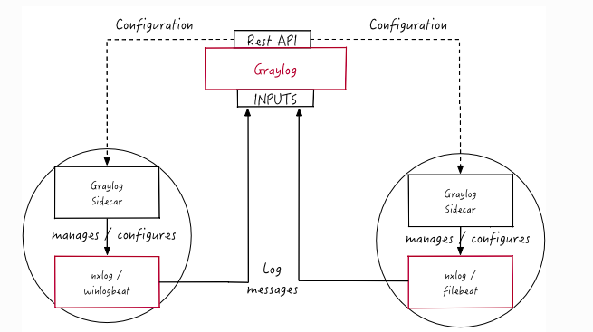
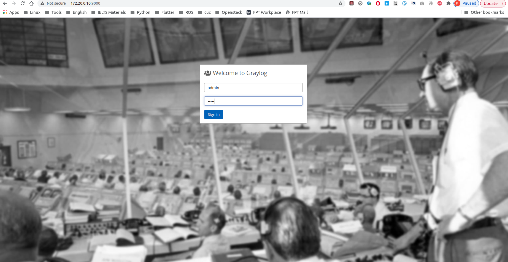
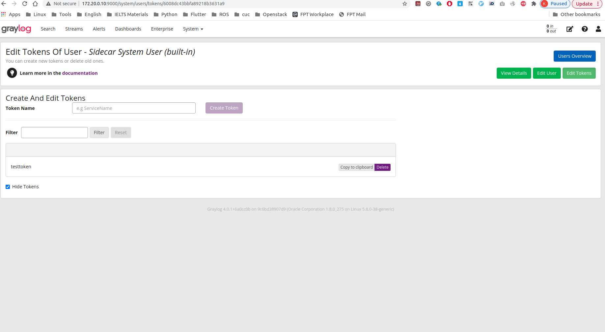
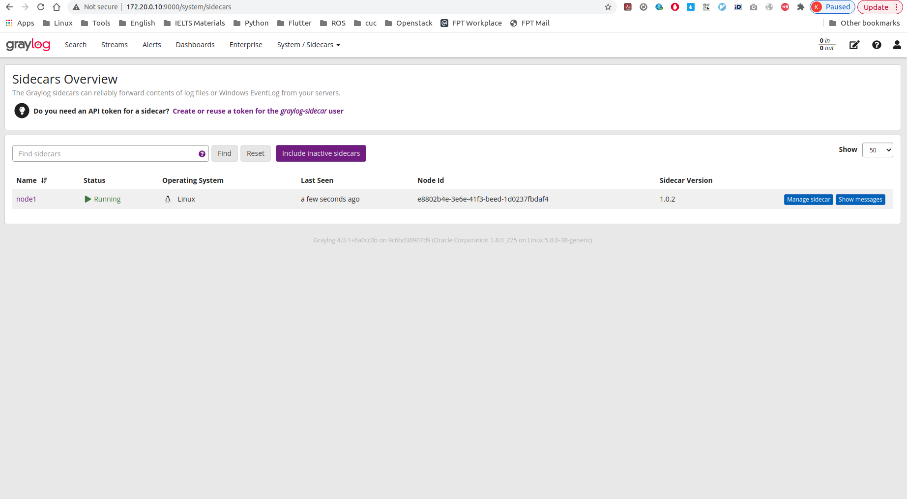
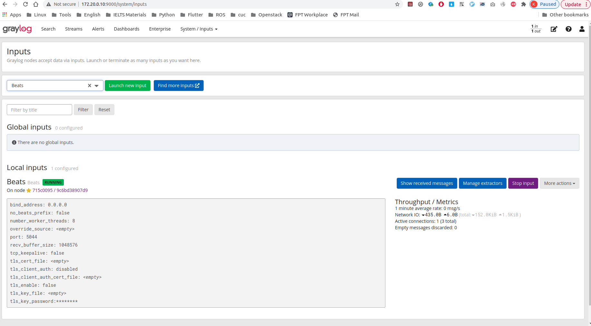
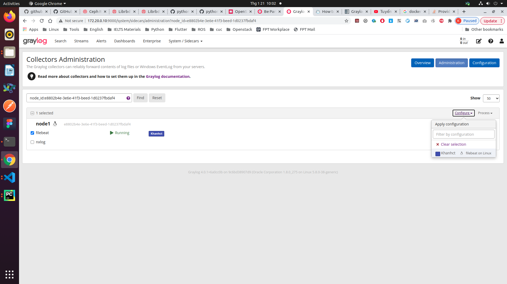

# How to setup Graylog

## Architecture 



## Step 1 Install Graylog
In the master node

```sh
docker-compose up
```



## Step 2: Install Graylog Sidecar
In slave node

```sh
wget https://github.com/Graylog2/collector-sidecar/releases/download/1.0.2/graylog-sidecar_1.0.2-1_amd64.deb
sudo dpkg -i graylog-sidecar_1.0.2-1_amd64.deb

```
##### Install Filebeat
```sh
curl -L -O https://artifacts.elastic.co/downloads/beats/filebeat/filebeat-7.10.2-amd64.deb
sudo dpkg -i filebeat-7.10.2-amd64.deb
```

#### Get token 
Access System/Sidecars



#### Edit Sidecar config 

```sh
vim /etc/graylog/sidecar/sidecar.yml
service graylog-sidecar restart
```

```
# The URL to the Graylog server API.
server_url: "http://172.20.0.10:9000/api/"

# The API token to use to authenticate against the Graylog server API.
# This field is mandatory
server_api_token: "1bjtc2j4p05uv5bdmggaia9nlffumhcu222bfthdj23n11ahg7f6"

# The node ID of the sidecar. This can be a path to a file or an ID string.
# If set to a file and the file doesn't exist, the sidecar will generate an
# unique ID and writes it to the configured path.
#
# Example file path: "file:/etc/graylog/sidecar/node-id"
# Example ID string: "6033137e-d56b-47fc-9762-cd699c11a5a9"
#
# ATTENTION: Every sidecar instance needs a unique ID!
#
#node_id: "node1"

# The node name of the sidecar. If this is empty, the sidecar will use the
# hostname of the host it is running on.
node_name: "node1"

# The update interval in secods. This configures how often the sidecar will
# contact the Graylog server for keep-alive and configuration update requests.
#update_interval: 10

# This configures if the sidecar should skip the verification of TLS connections.
# Default: false
tls_skip_verify: false

# This enables/disables the transmission of detailed sidecar information like
# collector statues, metrics and log file lists. It can be disabled to reduce
# load on the Graylog server if needed. (disables some features in the server UI)
#send_status: true

# A list of directories to scan for log files. The sidecar will scan each
# directory for log files and submits them to the server on each update.
#
# Example:
#     list_log_files:
#       - "/var/log/nginx"
#       - "/opt/app/logs"
#
# Default: empty list
#list_log_files:
#  - "/var/log/cas"

# Directory where the sidecar stores internal data.
#cache_path: "/var/cache/graylog-sidecar"

# Directory where the sidecar stores logs for collectors and the sidecar itself.
log_path: "/var/log/graylog-sidecar"
# The maximum size of the log file before it gets rotated.
#log_rotate_max_file_size: "10MiB"

# The maximum number of old log files to retain.
#log_rotate_keep_files: 10

# Directory where the sidecar generates configurations for collectors.
#collector_configuration_directory: "/var/lib/graylog-sidecar/generated"

# A list of binaries which are allowed to be executed by the Sidecar. An empty list disables the whitelist feature.
# Wildcards can be used, for a full pattern description see https://golang.org/pkg/path/filepath/#Match
# Example:
#     collector_binaries_whitelist:
#       - "/usr/bin/filebeat"
#       - "/opt/collectors/*"
#
# Example disable whitelisting:
#     collector_binaries_whitelist: []
#
# Default:
# collector_binaries_whitelist:
#  - "/usr/bin/filebeat"
#  - "/usr/bin/packetbeat"
#  - "/usr/bin/metricbeat"
#  - "/usr/bin/heartbeat"
#  - "/usr/bin/auditbeat"
#  - "/usr/bin/journalbeat"
#  - "/usr/share/filebeat/bin/filebeat"
#  - "/usr/share/packetbeat/bin/packetbeat"
#  - "/usr/share/metricbeat/bin/metricbeat"
#  - "/usr/share/heartbeat/bin/heartbeat"
#  - "/usr/share/auditbeat/bin/auditbeat"
#  - "/usr/share/journalbeat/bin/journalbeat"
#  - "/usr/bin/nxlog"
#  - "/opt/nxlog/bin/nxlog"
```

View Result


## Step 3: Config Filebeat Input

Clict System/Inputs and Launch new inputt



## Step 4 Config collector


### Clict Manage Sidecar and then click Configuration


### Attach Sidecar
Clict Manage Sidecar


Then Click filebeat and choose your sidecars in Configure tab

