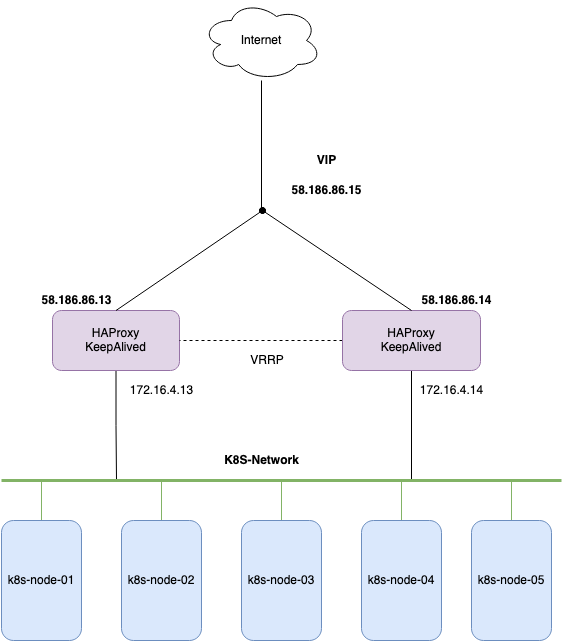

# Install HAProxy KeepAlived on CentOS 7



## Host Details

Node 01:

- Public interface: eth0
- Public IP: 58.186.86.13
- Internal interface: eth1
- Internal IP: 172.16.4.13

Node 02:

- Public interface: eth0
- Public IP: 58.186.86.14
- Internal interface: eth1
- Internal IP: 172.16.4.14

VIP IP: 58.186.86.15

## Configure sysctl

```sh
echo "net.ipv4.ip_nonlocal_bind = 1" "net.ipv4.ip_forward = 1" >> /etc/sysctl.conf
```

```sh
sysctl -p

net.ipv4.ip_nonlocal_bind = 1
net.ipv4.ip_forward = 1
```

## Install and configure KeepAlived

Install keepalived on 02 node

```sh
yum install -y keepalived
```

Configure MASTER on Node 01

```sh
cat <<EOF > /etc/keepalived/keepalived.conf
vrrp_script chk_haproxy {
    script "killall -0 haproxy"
    interval 2
    weight 2
}
vrrp_instance VI_1 {
    interface eth0
    state MASTER
    virtual_router_id 51
    priority 102
    virtual_ipaddress {
        58.186.86.15/26
    }
    track_script {
        chk_haproxy
    }
}
EOF
```

Configure BACKUP on Node 02

```sh
cat <<EOF > /etc/keepalived/keepalived.conf
vrrp_script chk_haproxy {
    script "killall -0 haproxy"
    interval 2
    weight 2
}
vrrp_instance VI_1 {
    interface eth0
    state BACKUP
    virtual_router_id 51
    priority 99
    virtual_ipaddress {
        58.186.86.15/26
    }
    track_script {
        chk_haproxy
    }
}
EOF
```

## Install and configure HAProxy

### Install HAProxy on both Nodes

```sh
yum install wget socat -y
wget http://cbs.centos.org/kojifiles/packages/haproxy/1.8.1/5.el7/x86_64/haproxy18-1.8.1-5.el7.x86_64.rpm
yum install haproxy18-1.8.1-5.el7.x86_64.rpm -y
```

### Configure HAProxy on both Nodes

Create a new `/etc/haproxy/haproxy.cfg` and paste the following lines:

```sh
global
    log         127.0.0.1 local2
    chroot      /var/lib/haproxy
    pidfile     /var/run/haproxy.pid
    maxconn     4000
    user        haproxy
    group       haproxy
    daemon
    stats socket /var/lib/haproxy/stats

defaults
    mode                    http
    maxconn                 8000
    log                     global
    option                  httplog
    option                  dontlognull
    option http-server-close
    retries                 3
    timeout http-request    20s
    timeout queue           1m
    timeout connect         10s
    timeout client          1m
    timeout server          1m
    timeout http-keep-alive 10s
    timeout check           10s

listen stats
    bind *:8080 interface eth1
    mode http
    stats enable
    stats uri /cashastats
    stats realm HAProxy\ Statistics
    stats auth cas:TY4f762o5vmQudaB
    stats refresh 30s

frontend http-in
  bind *:80
  bind *:443 ssl crt /etc/ssl/fptcompute_com_vn.pem
  reqadd X-Forwarded-Proto:\ http

  acl fptcompute_com_vn hdr(host) -i fptcompute.com.vn
  acl api_fptcompute_com_vn hdr(host) -i api.fptcompute.com.vn
  acl cms_fptcompute_com_vn hdr(host) -i cms.fptcompute.com.vn

  use_backend fptcompute_com_vn if fptcompute_com_vn
  use_backend api_fptcompute_com_vn if api_fptcompute_com_vn
  use_backend cms_fptcompute_com_vn if cms_fptcompute_com_vn

backend api_fptcompute_com_vn
  option httpclose
  option forwardfor
  redirect scheme https if !{ ssl_fc }
  server api-lb-01 172.16.4.201:80 check port 80

backend fptcompute_com_vn
  option httpclose
  option forwardfor
  redirect scheme https if !{ ssl_fc }
  server dash-lb-01 172.16.4.203:80 check port 80

backend cms_fptcompute_com_vn
  option httpclose
  option forwardfor
  redirect scheme https if !{ ssl_fc }
  server cms-lb-01 172.16.4.206:80 check port 80
```

## Configure Firewalld for KeepAlived and HAProxy

Change `eth1` interface to Internal Zone, `eth0` default in Public Zone

```sh
firewall-cmd --zone=internal --change-interface=eth1
```

Allow `VRRP` traffic between two node

```sh
firewall-cmd --zone=public --add-rich-rule='rule protocol value="vrrp" accept' --permanent
```

Allow `HTTP` and `HTTPS` service on Public Zone

```sh
firewall-cmd --zone=public --permanent --add-service=http
firewall-cmd --zone=public --permanent --add-service=https
```

Remove `ssh` service and block ICMP on Public Zone

```sh
firewall-cmd --zone=public --permanent --remove-service ssh
firewall-cmd --zone=public --add-icmp-block-inversion --permanent
```

Allow `ssh` service on Internal Zone

```sh
firewall-cmd --zone=public --permanent --add-port=8080/tcp
```

Reload `firewalld` to apply configures

```sh
firewall-cmd --reload
```

Check again

```sh
$ firewall-cmd --zone=public --list-all

public (active)
  target: default
  icmp-block-inversion: yes
  interfaces: eth0
  sources:
  services: dhcpv6-client http https
  ports:
  protocols:
  masquerade: no
  forward-ports:
  source-ports:
  icmp-blocks:
  rich rules:
        rule protocol value="vrrp" accept
```

```sh
$ firewall-cmd --zone=internal --list-all

internal (active)
  target: default
  icmp-block-inversion: no
  interfaces: eth1
  sources:
  services: dhcpv6-client mdns samba-client ssh
  ports: 8080/tcp
  protocols:
  masquerade: no
  forward-ports:
  source-ports:
  icmp-blocks:
  rich rules:
```

## Enable and start services

```sh
systemctl enable keepalived haproxy
systemctl start keepalived haproxy

```

## Check again

### KeepAlived

```sh
# On KeepAlived Master
ip -4 a
1: lo: <LOOPBACK,UP,LOWER_UP> mtu 65536 qdisc noqueue state UNKNOWN group default qlen 1000
    inet 127.0.0.1/8 scope host lo
       valid_lft forever preferred_lft forever
2: eth0: <BROADCAST,MULTICAST,UP,LOWER_UP> mtu 1500 qdisc pfifo_fast state UP group default qlen 1000
    inet 58.186.86.13/26 brd 58.186.86.63 scope global noprefixroute eth0
       valid_lft forever preferred_lft forever
    inet 58.186.86.15/26 scope global secondary eth0
       valid_lft forever preferred_lft forever
3: eth1: <BROADCAST,MULTICAST,UP,LOWER_UP> mtu 1500 qdisc pfifo_fast state UP group default qlen 1000
    inet 172.16.4.13/16 brd 172.16.255.255 scope global noprefixroute eth1
       valid_lft forever preferred_lft forever
```

### HAProxy


