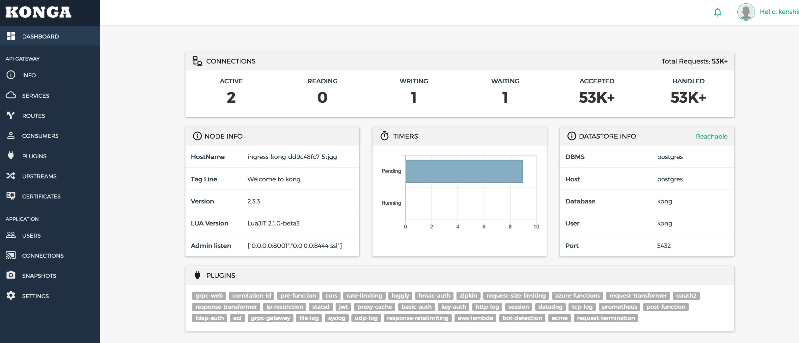
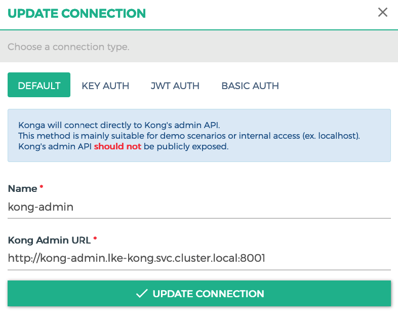
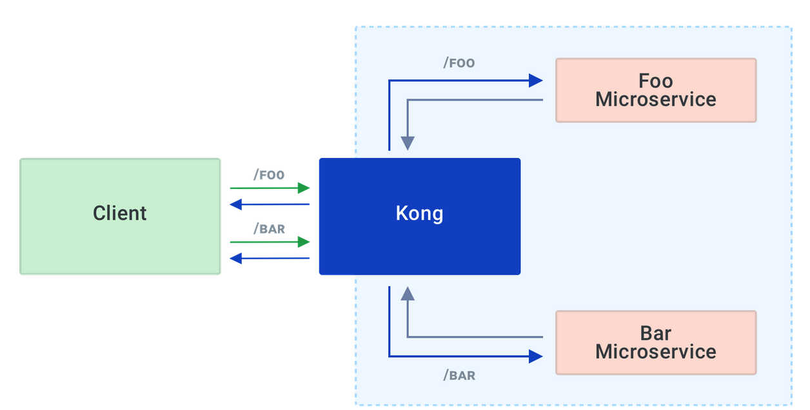
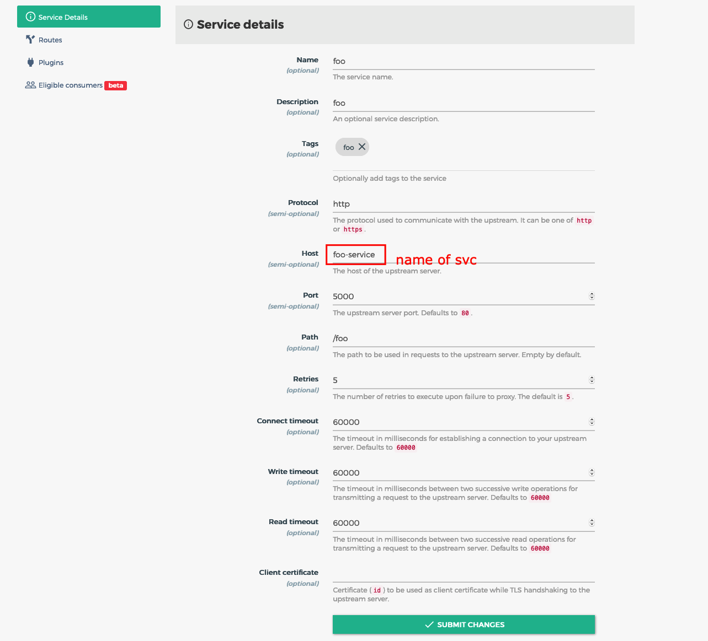
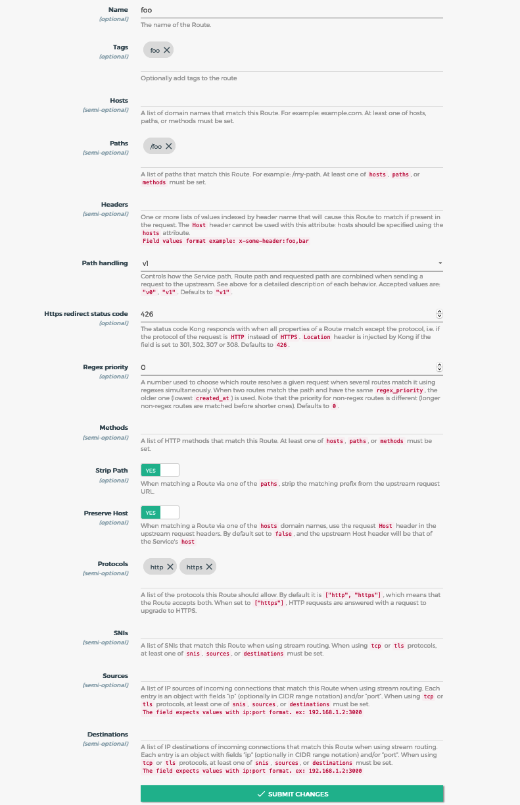

# 

# Kong for Kubernetes

Use Kong for Kubernetes Ingress. Configure plugins, health checking, load balancing and more in Kong for Kubernetes Services, all using Custom Resource Definitions(CRDs) and Kubernetes-native tooling.

## Features

- **Ingress routing**: Use Ingress resources to configure Kong -**Enhandced API Management using Plugin**: Use a wide-array of plugis to monitor, transform, protect your traffic.
- **Native gRPC support** : Proxy gRPC traffic and gain visibility into it using Kong's plugin.
- **Health checking and Load-balancing** : Load balance requests across your pods and supports active & passive health-checks.
- **Request/response transformations** : Use plugins to modify your requests/responses on the fly.
- **Authentication Protect** : your services using authentication methods of your choice.
- **Declarative configuration for Kong** : Configure all of Kong using CRDs in Kubernetes and manage Kong declaratively.

## Deploy Kong

Kong for Kubernetes is an Ingress Controller based on Open-Source Kong Gateway. It consists of two components:

- **Kong**: the Open-Source Gateway
- **Controller**: a daemon process that intergrates with Kubernetes platform and configures Kong.

Deploy Kong with Postgress Database:

- Change `namespace` in `yaml` file.

```yaml
apiVersion: v1
kind: Namespace
metadata:
  name: lke-kong
---
.
.
.
---
apiVersion: v1
kind: ServiceAccount
metadata:
  name: kong-serviceaccount
  namespace: lke-kong
---
.
.
.
```

- Change `storageclass` to storageclass of your k8s cluster.

```yaml
volumeClaimTemplates:
  - metadata:
      name: datadir
    spec:
      accessModes:
        - ReadWriteOnce
      storageClassName: linode-block-storage-retain
      resources:
        requests:
          storage: 1Gi
```

- Deploy Kong

```sh
kubectl apply -f all-in-one-postgres-2_3.yaml
```

- Check service up and running

```sh
kubectl -n lke-kong get pod

ingress-kong-dd9c48fc7-5tjgg      2/2     Running     0          2d23h
kong-migrations-sw9z2             0/1     Completed   0          2d23h
postgres-0                        1/1     Running     0          2d23h
```

```sh
kubectl -n lke-kong get svc
kong-admin                ClusterIP      10.128.195.248   <none>           8001/TCP,8444/TCP            2d23h
kong-proxy                LoadBalancer   10.128.28.152    139.162.26.166   80:30700/TCP,443:31043/TCP   2d23h
kong-validation-webhook   ClusterIP      10.128.84.252    <none>           443/TCP                      2d23h
postgres                  ClusterIP      10.128.213.250   <none>           5432/TCP                     2d23h
```

## Deploy Konga

[Konga](https://github.com/pantsel/konga) is an unofficial project which basically an UI for Admin API of Kong.

### Deploy Konga in same Kong's Kubernetes cluster

Apply YAML file with same `namespace` of Kong

```sh
kubectl -n lke-kong apply konga.yaml
```

Check Konga service

```sh
kubectl -n lke-kong get pod

ingress-kong-dd9c48fc7-5tjgg      2/2     Running     0          2d23h
kong-migrations-sw9z2             0/1     Completed   0          2d23h
konga-8456489b6-wgzcn             1/1     Running     0          2d18h
postgres-0                        1/1     Running     0          2d23h
```

```sh
kubectl -n lke-kong get svc

kong-admin                ClusterIP      10.128.195.248   <none>           8001/TCP,8444/TCP            2d23h
kong-proxy                LoadBalancer   10.128.28.152    139.162.26.166   80:30700/TCP,443:31043/TCP   2d23h
kong-validation-webhook   ClusterIP      10.128.84.252    <none>           443/TCP                      2d23h
konga-svc                 LoadBalancer   10.128.171.163   139.162.26.136   1337:32679/TCP               2d18h
postgres                  ClusterIP      10.128.213.250   <none>           5432/TCP                     2d23h
```

Access to: http://139.162.26.136:1337 and configure username and password for Konga



Connect to Kong API Admin

**CONNECTION** -> **NEW CONNECTION** -> **DEFAULT**



## Testing connectivity to Kong



### Deploy dummy Microservices

```yaml
cat <<EOF | kubectl -n lke-kong apply -f -
apiVersion: apps/v1
kind: Deployment
metadata:
  name: foo-deployment
spec:
  replicas: 1
  selector:
    matchLabels:
      app: foo
  template:
    metadata:
      labels:
        app: foo
    spec:
      containers:
      - name: api
        image: vietdv277/foo-microservice:0.1
        ports:
        - containerPort: 5000
---
apiVersion: v1
kind: Service
metadata:
  name: foo-service
  labels:
    app: foo-service
spec:
  ports:
  - port: 5000
    name: http
    targetPort: 5000
  selector:
    app: foo
EOF
```

```yaml
cat <<EOF | kubectl -n lke-kong apply -f -
apiVersion: apps/v1
kind: Deployment
metadata:
  name: bar-deployment
spec:
  replicas: 1
  selector:
    matchLabels:
      app: bar
  template:
    metadata:
      labels:
        app: bar
    spec:
      containers:
      - name: api
        image: vietdv277/bar-microservice:0.1
        ports:
        - containerPort: 5000
---
apiVersion: v1
kind: Service
metadata:
  name: bar-service
  labels:
    app: bar-service
spec:
  ports:
  - port: 5000
    name: http
    targetPort: 5000
  selector:
    app: bar
EOF
```

### Add new service in Kong

Create `foo` **Service** and `foo` **Route**. Do the same with the `bar` Service


Create `foo` **Route**. Do


### Test connect to `foo` and `bar` Microservice

```sh
curl -X GET http://139.162.26.166/foo

{"msg":"Hello from the foo microservice"}%
```

```sh
curl -X GET http://139.162.26.166/bar

{"msg":"Hello from the bar microservice"}%
```
