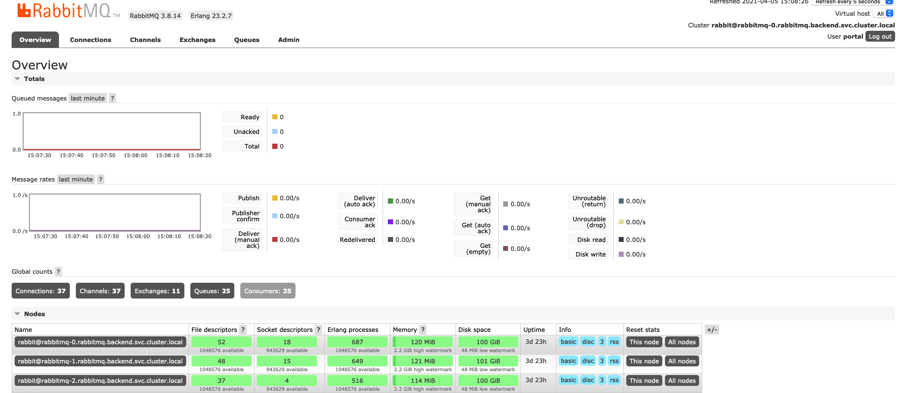

# RabbitMQ on Kubernetes

Deploy RabbitMQ on RKE cluster

## Create namespace

Create `backend` namespace

```sh
kubectl create ns backend
```

## Get StorageClass

```sh
kubectl get storageclass
NAME                   PROVISIONER             RECLAIMPOLICY   VOLUMEBINDINGMODE      ALLOWVOLUMEEXPANSION   AGE
local-path (default)   rancher.io/local-path   Delete          WaitForFirstConsumer   false                  18d
```

## Deployment

```sh
kubectl -n backend apply -f rabbit-rbac.yaml
kubectl -n backend apply -f rabbit-configmap.yaml
kubectl -n backend apply -f rabbit-secret.yaml
kubectl -n backend apply -f rabbit-statefulset.yaml
```

## Access the UI

```sh
kubectl -n backend port-forward rabbitmq-0 15672:15672
```


