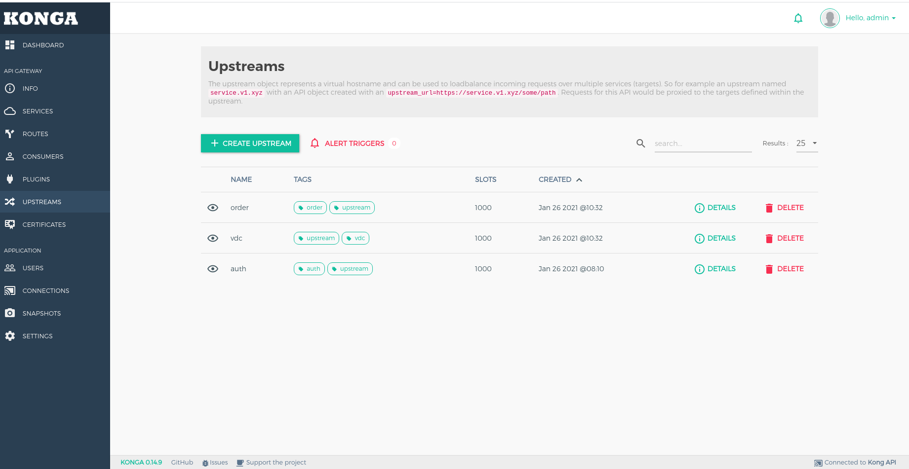

## Step 1: Build Kong API Gateway

```sh
export KONG_NETWORK=kong-net
export KONG_DB_IMG=caspostgres
docker network create ${KONG_NETWORK}
cd postgres
docker build --no-cache -t ${KONG_DB_IMG} .

cd ../
docker-compose down --volumes
docker-compose up -d
```

Result:


## Step 2: How to config API Gateway


### 1. Create Kong Upstream
Click UPSTREAMS tab in the sidebar then click Create Upstream


Result:


### 2. Create Kong Upstream target
Click Kong upstream detail then create new target


Result:


### 3. Create Kong Service
Click SERVICES tab in the sidebar then click Create Service


Result:


### 3. Create Kong Service
Click Kong service detail then create new router to service


Result:
